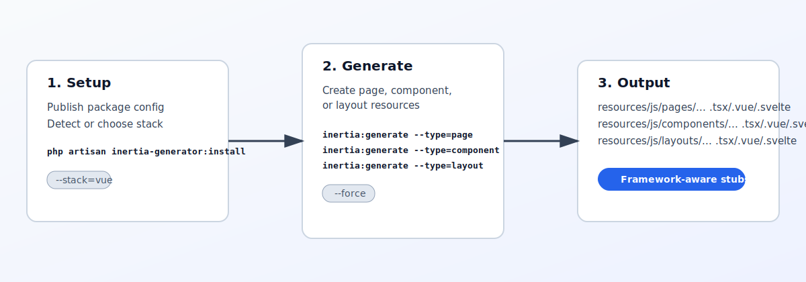

# Laravel-Inertia-Generator

Laravel Inertia Generator is a Laravel package for scaffolding new Inertia frontend resources in Laravel projects using React, Vue, or Svelte.

The package separates setup from generation:

- Install commands handle package setup and framework detection.
- Generate commands create new frontend artifacts from framework-specific stubs.

This means pages, components, and layouts are generated on dedicated generate commands, not during install.

## What You Can Generate

- New Inertia pages
- Reusable frontend components
- Layout components
- Framework-specific output files with the right extension (`.tsx`, `.vue`, `.svelte`)
- Generated resources based on your selected or detected frontend stack

## Why Use It

- Speeds up frontend scaffolding for Inertia projects
- Keeps page/component/layout structure consistent
- Reduces repetitive manual boilerplate
- Supports both automatic framework detection and explicit stack selection

## Typical Workflow

1. Run install/setup to publish package configuration and prepare the package in your app.
2. Run generation commands when you need new resources.
3. Choose what to generate (page/component/layout) and the target name.
4. Let the package generate files from the correct framework stubs.

In short: install prepares the package, generate commands create the actual frontend resources.

## What It Does (Visual)



The package workflow is simple:

- Setup once with the install command
- Generate pages, components, and layouts with dedicated generate commands
- Get framework-specific output files for React, Vue, or Svelte

## How To

### 1. Install and prepare the package

Run the install command to publish package configuration and initialize setup:

```bash
php artisan inertia-generator:install
```

If you want to explicitly target a frontend stack:

```bash
php artisan inertia-generator:install --stack=react
php artisan inertia-generator:install --stack=vue
php artisan inertia-generator:install --stack=svelte
```

### 2. Detect the current frontend framework (optional)

```bash
php artisan inertia:detect-framework
```

### 3. Generate new resources

Generate a page:

```bash
php artisan inertia:generate --type=page --name=Dashboard
```

Generate a component:

```bash
php artisan inertia:generate --type=component --name=User/ProfileCard
```

Generate a layout:

```bash
php artisan inertia:generate --type=layout --name=AppLayout
```

Force overwrite an existing generated file:

```bash
php artisan inertia:generate --type=component --name=User/ProfileCard --force
```

Generate for a specific stack:

```bash
php artisan inertia:generate --type=page --name=Reports/Index --stack=vue
```
